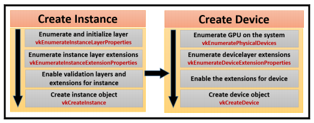

# Vulkan 3D Engine

- [Jargon and overview](docs/jargon_overview.md)

## Logical device (GPU abstraction) initialization

In one picture:

## Swapchain (surfaces to present to the screen) initialization

(The implementation of [this](https://github.com/massile/vulkan-engine/blob/master/docs/jargon_overview.md#window-presentation-surfaces)).
In one picture:

## Command buffer initialization

- **Create a command pool** with `vkCreateCommandPool`. It needs an index to a graphics queue with presentation support.

- **Allocate a command buffer** using `vkAllocateCommandBuffers` from the command pool.

## Resource objects

Vulkan treats **surfaces** like any other resource type.

Resource subdivision in the heap:

- **Image**: Stores 1D to 3D buffer arrays.
- **Buffer**: Represents resources with linear array types.
- **View**: Data in a buffer is stored in a contiguous fashion: a view specifies its format and how it should be interpreted.

A buffer can be used **directly**, unless it has to be accessed by a shader: a view shall be used.

An image **always** requires a view to be used.

## Creating a presentation surface

- **Get surface capabilities**
- **Get surface presentation modes**: tells how the surface is going to be updated
- **Create the swapchain**
- **Get the swapchain images**: two of them if it supports [double buffering](https://www.computerhope.com/jargon/d/doublebu.htm)
- **Set the image layout**: For each image, set the compatible layout and add a pipeline barrier
- **Create an image view**: the application can only consume view objects

How image views are used:

## Creating a depth image

Follows the same creation process as the swapchain, except that the image has to be created and allocated by the app.

## Resource allocation

Process:
  - Query memory on the physical device (exposes two heaps: the **system RAM** and **GPU RAM**)
  - Fetch memory requirements for the resource
  - Allocate memory through the logical device
  - Bind the resource to the allocated memory
  - Memory mapping: (how the content of GPU memory is updated) - it shall be mapped and updated on the CPU side.
  
## Shader compilation

The `glslangValidator.exe` LunarG tool is used to compile readable [GLSL](https://fr.wikipedia.org/wiki/OpenGL_Shading_Language) to [SPIR-V](https://www.khronos.org/registry/spir-v/specs/1.0/SPIRV.pdf)

The SPIR-V binary is then provided to the app using `vkCreateShaderModule`

## Building layouts (the pipeline)

A descriptor connects the resources with the shader through layout binding slots.

A pipeline layout is required to give access to the descriptor layouts.

## Creating a Render Pass

It describes the structure of the drawing work to the driver (= a render layer):
 - how data will flow between the various attachments (= images) 
 - what the ordering requirements are
 - whether an attachment shall be cleared of preserved

It only describes the format and the way the image is loaded and stored.
     
## Framebuffer
 
A collection of image views, corresponding to the attachment specified in the Render Pass.

## Creating geometry

Geometry data is interleaved and described like this:

It will be stored in a buffer that shall be [allocated properly](/#Resource_Allocation).

Interleaved data is interpreted in the pipeline using:
 - A `VkVertexInputBindingDescription`: helps the pipeline read data (ie. stride etc.).
 - A `VkVertexInputAttributeDescription`: interprets the data.
 
## Pipeline state management
 
 - **Graphics pipeline**: multiple shader stages, multiple fixed-function pipeline stages.
 - **Compute pipeline**: consists of a single static compute shader stage and the pipeline layout.
  
### Defining pipeline states

 - **Dynamic states**: notifies the pipeline about what states are expected to change at runtime.
 - **Vertex input**: helps the pipeline to understand the reading and interpretation of data.
 - **Input assembly**: describes the vertex data topology.
 - **Rasterization**: process by which a primitive is converted into a two-dimensional image.
 - **Color blend attachment**: A combination of a source and a destination color.
 - **Viewport**: Controls the viewport transformation.
 - **Depth stencil**: Controls the depth bound tests, stencil test, and depth test.
 - **Multisample**: Controls the behavior of the antialiasing of rasterized primitives.

### Create graphics pipeline

 - Pipeline state object shall be cached using `VkPipelineCache`
 - A pipeline is created using `vkCreateGraphicsPipelines`
