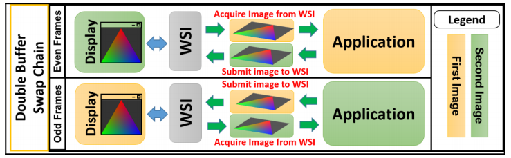
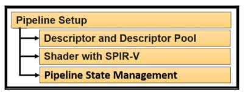

# Jargon and overview

## Vocabulary

- **Physical device** : A physical Vulkan-capable hardware device (GPU). It represents a unique device.
- **Device** : Refers to a logical representation of the physical device in an application.
- **Host**: Refers to a representation of the CPU and its associated memory.
- **Queue**  : An interface between the execution engine and the application. Gathers the jobs and dispatches them to the physical device.
- **Command** : An instruction to do some act.
- **Command buffer** :  A collection of commands; it records the commands and submits them to the queues.

## Vulkan's execution model

Command buffers are submitted into queues, which are consumed by the physical device to be processed.

Synchronizarion between queues can be controlled using:

 - **Semaphores** : Synchronizes work across multiple queues.
 - **Events** : Synchronizes work within a command buffer / within command buffers submitted to a queue.
 - **Fences** : Allows synchronization between the host (CPU) and the device (GPU).
 - **Pipeline barriers** : An instruction which ensures that commands are executed in order.

 
## The object model

All Vulkan entities are recognized using [handles](https://stackoverflow.com/a/13023487)

 - **Dispatchable handles** : Opaque types. Data can only be accessed using API routines.
 - **Non-Dispatchable handles** : May contain the object information, rather than a pointer to the structure.

## The object lifecycle's syntax

Within Vulkan :
 - **Create syntax** : Created using the vkCreate\* command which takes a Vk\*CreateInfo as a parameter.
 - **Destroy syntax** : Destroyed using vkDestroy\*.

Within an object [pool](https://en.wikipedia.org/wiki/Pool_(computer_science)) or [heap](https://stackoverflow.com/a/80113):
 - **Allocate syntax** : Created using the vkAllocate\* command which takes a Vk\*AllocateInfo as a parameter.
 - **Freeing syntax** : Released from the pool / memory using vkFree\*.

## Components of a Vulkan application

 - **Driver** : Acts as an interface between the application and the device itself.
 - **Application** : A user program that is intended to make use of Vulkan.
 - **WSI** : Set of extensions for the unification of the presentation layer accross different platforms.
 - **SPIR-V**: Precompiled binary format for specifying shaders.
 - **LunarG SDK**:  Set of tools and resources to aid Vulkan application development (docs, debug tools, ...).

## The Vulkan programming model

### Hardware initialization

The application activates the Vulkan drivers by communicating with the *loader* its responsibilites are:
  - **locating the driver**
  - **it should be platform independent** (platform differences are expressed as *extensions*)
  - **layers can be injected** (driver doesn't need to determine whether the API is used correctly anymore)

## Window presentation surfaces

We need an image to perform the drawing task and put it on the presentation window to display it.

Context creation does not need to involve the window system (unlike OpenGL), it is managed through WSI:
It manages the ownership of images via a **swapchain**: while one image is displayed, other ones can be prepared.

Steps in the application:
  - **Create a native window**
  - **Attach a WSI surface to the window**
  - **Create the swapchain to present to the surface**
  - **Request the images from the swapchain**

## Resource setup

Unlike OpenGL, Vulkan provides full low-level and explicit control of the memory.
Memory type configurations:
  - **Device local** (invisible to the host; fast) 
  - **Device local, host visible** (fast)
  - **Host local, host visible** (slow)

Process for resource management:
  - **Create resource objects** (either buffer objects or images) -> returns a *logical* address
  - **Allocate and bind memory to the address** put different kind of resources at once using *suballocation*
  - **[Sparse memory](https://en.wikipedia.org/wiki/Sparse_distributed_memory)** stores resources which are much larger than the actual memory size by breaking it into tiles.
  - **Staging buffers** The ideal memory placement for a resource may not be host visible. In this
case, the application must first create the resource in a staging buffer that is host visible.
  - **Async transfer** Data is transferred asynchronously using asynchronous commands.

## Pipeline setup

A pipeline is a set of events that occur in a fixed sequence.

- **Descriptor sets and descriptor pools**  interface between resources and shaders. It is subdivided at different levels for performance:
  - low frequency updates (scene level)
  - medium frequency updates (model level)
  - high frequency updates (draw level)

- **Shaders** it shall be compiled from GLSL to SPIR-V
- **Pipeline states** a set of settings that tells the physical device how a geometry shall be interpreted (rasterizer state, blend state, depth stencil state etc...)
  - they are described using **Pipeline layouts** which describe how the descriptors / resources will be used
  - it can be cached with a **Pipeline Cache Object**

## Recording commands

It's the process of forming command buffers. They are allocated from a **command pool**. 
A command buffer is recorded by supplying commands within a given start and end scope.

## Queue submission

Once the command buffers are recorded they can sent to the physical device via queues.
A queue submission job,
 - acquires the images from the swapchain
 - deploys any synchronization mechanism
 - gathers the command buffer and submits it to the required queue
 - requests the presentation of the completed images on the output

